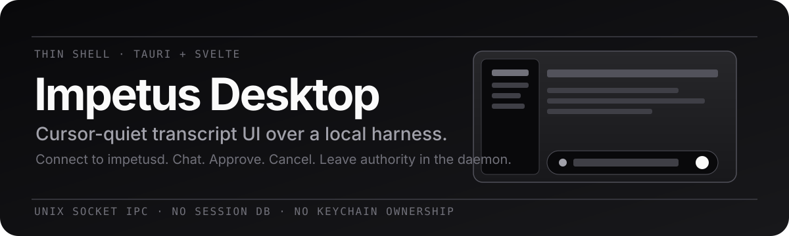
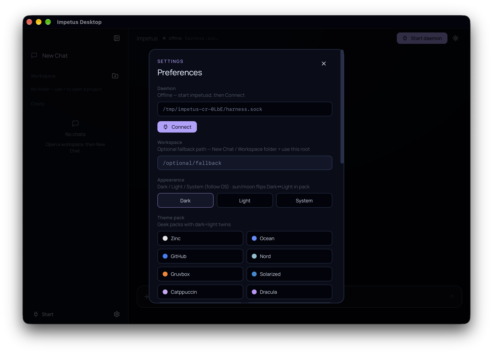
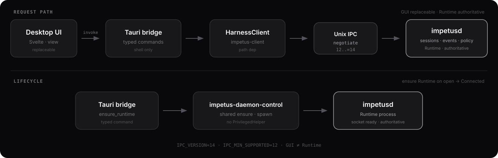

# Impetus Desktop

> **Thin macOS transcript client for the Impetus harness — Cursor-quiet UI, daemon-owned authority.**

[](package.json)
[](#how-it-works)
[](TODO.md)

<p align="center">
  
</p>

Impetus Desktop is a **view + command** surface. It talks to a running
[`impetusd`](../impetus) over versioned Unix-socket IPC. The window never owns
session SQLite, Keychain secrets, or policy — those stay in the daemon.

Sibling of the terminal harness: [`impetus`](../impetus)
([issue #310](https://github.com/1tuz/impetus/issues/310)).

## Proof

<p align="center">
  
</p>

## Why a thin shell

Engineering agents need durable state and controlled tools. Putting that in a
GUI process couples crash recovery, secrets, and policy to a WebView. Desktop
stays replaceable: reconnect, resume, keep working.

| Layer | Owns |
| --- | --- |
| `impetusd` | sessions, events, policy, sandbox, secret **refs** |
| Impetus Desktop | window, typed Tauri commands, transcript display |

## How it works

<p align="center">
  
</p>

```text
Desktop UI ──invoke──▶ HarnessClient ──Unix IPC──▶ impetusd
```

Open work (IPC rebase, live stream, approvals, modes): [TODO.md](TODO.md).

## Permissions

Normal Connect / Prompt over the Unix socket needs **no** Accessibility, Screen
Recording, or Full Disk Access. First launch only checks that `impetusd` is
reachable, then offers Connect. System Settings open only from Preferences →
Advanced → explicit click.

## Install

```bash
pnpm install
pnpm tauri build --bundles app,dmg
# DMG contains Applications → /Applications — drag Impetus Desktop.app there
open -a "Impetus Desktop"
```

From the harness repo (when wired):

```bash
impetus desktop   # open -a "Impetus Desktop"
```

## Run (dev)

```bash
# terminal 1 — daemon from sibling repo
cd ../impetus && cargo run -p impetusd

# terminal 2 — this repo
pnpm tauri dev
```

Socket: `$IMPETUS_SOCKET` or
`~/Library/Application Support/Impetus/harness.sock`.

## Keyboard shortcuts

Listed in **Preferences** only (no chrome clutter). Defaults include:

| Chord | Action |
| --- | --- |
| ⌘N | New Chat |
| ⌘O | Open workspace |
| ⌘G | Attach files |
| ⌘↵ | Send |
| ⌘B | Toggle session rail |
| ⌘, | Preferences |
| ⌘⇧T | Cycle theme pack |

## Verify

```bash
pnpm verify          # check + selfchecks
pnpm check && pnpm test
cd src-tauri && cargo fmt && cargo check && cargo clippy -- -D warnings && cargo test
```

PR CI uses a path-aware **Gate** (same idea as terminal Impetus). Enable
auto-merge with `gh pr merge --auto --squash` after creating a PR. Details:
[AGENTS.md](AGENTS.md) · [CONTRIBUTING.md](CONTRIBUTING.md).

## Related

- Terminal harness + TUI: [`impetus`](../impetus)
- Desktop backlog: [TODO.md](TODO.md)
- Architecture truth (daemon): [`impetus/ARCHITECTURE.md`](../impetus/ARCHITECTURE.md)
